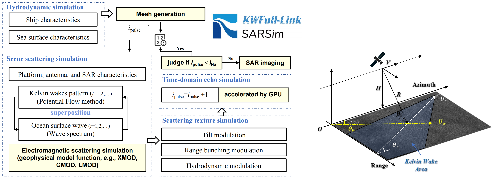

# KWFull-Link_SARSim

#### A SAR Kelvin Wake Full-Link Simulator

KWFull-Link_SARSim is a simulator for Kelvin wakes in SAR images. Unlike the previous approximation model, we adopt the full-link simulation to realize the simulation of sea surface SAR imaging, and the simulation process includes the process of electromagnetic scattering, sea surface motion, platform motion, pulse-echo generation, radar signal acquisition, image processing, etc.

Since our paper is currently undergoing review, we are only able to provide the lite version of the executable program.

If you have any problem, please contact me by email：xuchj9@mail2.sysu.edu.cn

Note:  Before running SAR_Simulator_ShareVersion.exe, you must download the necessary .dll files from [Baiduyun](https://pan.baidu.com/s/17GhClkoXFURNO6Dchb7KGA?pwd=9mjr ) or [Onedrive](https://1drv.ms/u/s!AqTp7jo0qiKFkTIpZbI8QRAh2Whr?e=eZDKGh) and put them under the same directory!

